# Image Resource Controller

Image Resource Controller is a Kubernetes Operator that automatically detects container images from AWS ECR, generates Kubernetes resources, and commits them to Git repositories. It provides complete automation for container image updates through GitOps workflow integration.

## Overview

This Operator consists of two independent controllers:

- **Detection Manager**: Monitors ECR to detect images and creates `ImageDetected` resources
- **Creation Manager**: Generates Kubernetes manifests from detected images and commits to Git repositories

## Architecture


## User Flow & Use Cases

### End-to-End User Flow


### Use Case: Multi-Environment Pipeline

```mermaid
graph LR
    subgraph "Development Flow"
        DEV1[Developer A<br/>Push: myapp:dev-v1.2.0]
        DEV2[Developer B<br/>Push: myapp:dev-v1.3.0]
    end
    
    subgraph "Staging Flow"  
        STAGE1[QA Team<br/>Push: myapp:staging-v1.2.0]
        STAGE2[QA Team<br/>Push: myapp:staging-v1.2.1]
    end
    
    subgraph "Production Flow"
        PROD1[Release Manager<br/>Push: myapp:prod-v1.2.0]
        PROD2[Release Manager<br/>Push: myapp:prod-v1.2.1]
    end
    
    DEV1 --> CONTROLLER[Image Resource Controller]
    DEV2 --> CONTROLLER
    STAGE1 --> CONTROLLER
    STAGE2 --> CONTROLLER
    PROD1 --> CONTROLLER
    PROD2 --> CONTROLLER
    
    CONTROLLER --> DECISION{Tag Prefix<br/>Extraction}
    
    DECISION -->|dev prefix| DEVK8S[Dev Cluster<br/>✅ New manifest created]
    DECISION -->|staging prefix| STAGEK8S[Staging Cluster<br/>✅ New manifest created]  
    DECISION -->|prod prefix| PRODK8S[Production Cluster<br/>✅ New manifest created]
    
    DEV2 -.->|Same dev prefix| DEVSKIP[Dev: Skip creation<br/>🔄 GitOps handles update]
    STAGE2 -.->|Same staging prefix| STAGESKIP[Staging: Skip creation<br/>🔄 GitOps handles update]
    PROD2 -.->|Same prod prefix| PRODSKIP[Production: Skip creation<br/>🔄 GitOps handles update]
    
    style CONTROLLER fill:#e8f5e8
    style DEVK8S fill:#e3f2fd
    style STAGEK8S fill:#fff8e1
    style PRODK8S fill:#fce4ec
    style DEVSKIP fill:#f1f8e9
    style STAGESKIP fill:#fffde7
    style PRODSKIP fill:#fdf2f8
```



### Use Case: Integration with GitOps Tools


## Key Features

### Image Detection

- **Flexible Pattern Matching**
  - Repository patterns: `team-a/*`, `service-*`
  - Image name patterns: `nginx-*`, `*-service`
  - Combined patterns: `team-a/*:v*`, `*/nginx:stable-*`

- **Advanced Image Selection Policies**
  - Semantic version range specification (`>=1.0.0`, `~1.2.0`)
  - Alphabetical sorting (ascending/descending)
  - Regular expression pattern matching with tag prefix extraction
  - Environment-aware version management (dev, staging, prod prefixes)

- **Efficient Scanning**
  - Concurrent execution control
  - Timeout configuration
  - Per-repository or cross-repository processing options

### Resource Generation

- **Go Template Engine** for flexible manifest generation
- **Smart Duplicate Detection** with comprehensive resource checking
  - Scans existing Deployments, StatefulSets, DaemonSets, Jobs, and CronJobs
  - Intelligent image name extraction from ECR URLs
  - Cache-based performance optimization with TTL (5 minutes default)
  - Cross-namespace resource discovery
- **Idempotent Processing** to prevent unnecessary Git commits
  - Compares full image names including registry, repository, and tags
  - Skips resource creation if identical images already exist in cluster
  - Maintains processing history and status tracking

### Git Integration

- **Multiple authentication methods** (SSH, Token, Basic auth)
- **Automatic commits** (message generation, file management)
- **Error handling** and retry functionality

### Operational Features

- **TTL-based automatic cleanup** (default 7 days)
- **Detailed status management** and Condition updates
- **Prometheus metrics** support
- **Health check** functionality

## Custom Resource Definitions

### ImageResourcePolicy

Defines ECR monitoring settings and image selection policies.

```yaml
apiVersion: automation.gitops.io/v1beta1
kind: ImageResourcePolicy
metadata:
  name: webapp-policy
  namespace: default
spec:
  ecrRepository:
    region: us-east-1
    repositoryPattern: "webapp/*"  # webapp/frontend, webapp/backend, etc.
    maxRepositories: 10
    scanTimeout: "5m"
  
  policy:
    perRepository: false  # Process across repositories
    semver:
      range: ">=1.0.0"    # Semantic version range
  
  templateRef:
    name: webapp-template
    namespace: default
  
  aws:
    roleArn: "arn:aws:iam::123456789012:role/ECRReadRole"  # Optional
  
  ttlDays: 7  # Auto cleanup after 7 days
```

### ResourceTemplate

Defines Kubernetes resource templates and Git configuration.

```yaml
apiVersion: automation.gitops.io/v1beta1
kind: ResourceTemplate
metadata:
  name: webapp-template
  namespace: default
spec:
  template: |
    apiVersion: apps/v1
    kind: Deployment
    metadata:
      name: {{ .ServiceName }}
      namespace: {{ .Namespace | default "default" }}
      labels:
        app: {{ .ServiceName }}
        version: {{ .ImageTag }}
    spec:
      replicas: 3
      selector:
        matchLabels:
          app: {{ .ServiceName }}
      template:
        metadata:
          labels:
            app: {{ .ServiceName }}
            version: {{ .ImageTag }}
        spec:
          containers:
          - name: {{ .ServiceName }}
            image: {{ .FullImageName }}
            ports:
            - containerPort: 8080
            env:
            - name: IMAGE_TAG
              value: "{{ .ImageTag }}"
            - name: IMAGE_DIGEST
              value: "{{ .ImageDigest }}"
  
  gitRepository:
    url: "https://github.com/your-org/k8s-manifests.git"
    branch: "main"
    path: "./applications"
    secretRef:
      name: git-credentials  # GitHub token or SSH key
  
  variables:
    namespace: "production"
    environment: "prod"
```

### ImageDetected

Holds information about detected images (auto-generated).

```yaml
apiVersion: automation.gitops.io/v1beta1
kind: ImageDetected
metadata:
  name: webapp-frontend-v1-2-3-abc12345
  namespace: default
spec:
  imageName: webapp-frontend
  imageTag: v1.2.3
  imageDigest: sha256:abc123...
  fullImageName: 123456789012.dkr.ecr.us-east-1.amazonaws.com/webapp/frontend:v1.2.3
  tagPrefix: "v"  # Extracted prefix when extractPrefix is enabled
  sourcePolicy:
    name: webapp-policy
    namespace: default
  detectedAt: "2025-01-13T14:00:00Z"
status:
  phase: Completed
  resourceCreated: true
  gitCommitSHA: "def456..."
  processedAt: "2025-01-13T14:05:00Z"
```

## Setup

### Prerequisites

- Kubernetes v1.11.3+
- Go 1.23.0+
- Docker 17.03+
- Access permissions to AWS ECR

### Installation

- **Install CRDs**

```bash
make install
```

- **Deploy Controllers**

```bash
# Build and push image
make docker-build docker-push IMG=your-registry/image-resource-controller:latest

# Deploy Detection Manager
make deploy-detection IMG=your-registry/image-resource-controller:latest

# Deploy Creation Manager
make deploy-creation IMG=your-registry/image-resource-controller:latest
```

### AWS Authentication Setup

#### Method 1: Using IAM Role

```yaml
spec:
  aws:
    roleArn: "arn:aws:iam::123456789012:role/ECRReadRole"
```

#### Method 2: Using Secret

```bash
kubectl create secret generic aws-credentials \
  --from-literal=accessKeyId=YOUR_ACCESS_KEY \
  --from-literal=secretAccessKey=YOUR_SECRET_KEY
```

```yaml
spec:
  aws:
    secretRef:
      name: aws-credentials
```

### Git Authentication Setup

#### GitHub Token

```bash
kubectl create secret generic git-credentials \
  --from-literal=token=ghp_your_github_token
```

#### SSH Key

```bash
kubectl create secret generic git-credentials \
  --from-file=ssh-privatekey=~/.ssh/id_rsa \
  --from-literal=ssh-passphrase=your_passphrase
```

## Duplicate Detection & Resource Checking

The Creation Manager includes sophisticated duplicate detection to prevent unnecessary resource creation and Git commits. This feature ensures idempotent operations and optimal performance.

### How It Works

- **Resource Discovery**

   ```
   Scans all workload resources across the cluster:
   - Deployments, StatefulSets, DaemonSets
   - Jobs, CronJobs
   - Init containers, ephemeral containers
   ```

- **Image Name Extraction**

   ```
   Intelligent parsing of container image references:
   123456789012.dkr.ecr.us-east-1.amazonaws.com/webapp/frontend:v1.2.3
   ↓ extracts to ↓
   frontend (base image name for matching)
   ```

- **Cache-Based Performance**
   
   ```
   - In-memory cache with 5-minute TTL
   - Cluster-wide scan only when cache expires
   - Thread-safe concurrent access
   - Statistics tracking (totalImages, totalResources)
   ```

- **Decision Logic**

   ```
   IF image exists in cluster:
     └── Skip processing + Log existing resources
   ELSE:
     └── Generate manifests + Commit to Git
   ```

### Example Workflow

```bash
# 1. ImageDetected resource created
kubectl get imagedetected
# NAME: webapp-frontend-v1-2-3-abc12345

# 2. Cache refresh (if expired)
2025-08-14T01:26:27+09:00 INFO Starting cluster-wide image usage scan
2025-08-14T01:26:27+09:00 INFO Cluster-wide image usage scan completed totalImages=7 totalResources=7

# 3. Duplicate check
2025-08-14T01:26:27+09:00 INFO Image existence check completed 
  imageName="123456789012.dkr.ecr.us-east-1.amazonaws.com/webapp/frontend:v1.2.3" 
  exists=true usageCount=1

# 4. Skip processing
2025-08-14T01:26:27+09:00 INFO Image already exists in cluster, skipping resource creation and Git operations
2025-08-14T01:26:27+09:00 INFO Found existing resource using this image 
  resourceKind="Deployment" resourceName="webapp-frontend-deployment" 
  resourceNamespace="default" containerName="frontend"
```

### Performance Considerations

- **Cache Hit**: ~1ms response time for duplicate detection
- **Cache Miss**: ~100-500ms for cluster scan (depends on cluster size)
- **Memory Usage**: ~1KB per unique image in cluster
- **Network Overhead**: Minimal (Kubernetes API calls only on cache refresh)

### Troubleshooting Duplicate Detection

```bash
# Check if resources are being skipped correctly
kubectl logs -l control-plane=resource-creation-controller | grep "already exists"

# Verify cache statistics
kubectl logs -l control-plane=resource-creation-controller | grep "Cache statistics"

# Force cache refresh (restart controller)
kubectl rollout restart deployment/resource-creation-controller -n image-resource-controller-system
```

## Usage Examples

### 1. Single Repository Monitoring

```yaml
apiVersion: automation.gitops.io/v1beta1
kind: ImageResourcePolicy
metadata:
  name: nginx-policy
spec:
  ecrRepository:
    region: us-east-1
    repositoryPattern: "nginx-app"
  policy:
    alphabetical:
      order: "desc"  # Select latest tag
  templateRef:
    name: nginx-template
```

### 2. Semantic Versioning

```yaml
spec:
  policy:
    semver:
      range: "~1.2.0"  # Select latest in 1.2.x series
```

### 3. Per-Repository Processing

```yaml
spec:
  policy:
    perRepository: true  # Apply policy individually per repository
  ecrRepository:
    repositoryPattern: "microservices/*"
```

### 4. Tag Prefix Extraction for Environment Management

```yaml
apiVersion: automation.gitops.io/v1beta1
kind: ImageResourcePolicy
metadata:
  name: environment-aware-policy
spec:
  ecrRepository:
    region: us-east-1
    repositoryPattern: "webapp/*"
  policy:
    pattern:
      regex: "^(dev|staging|prod)-v\\d+\\.\\d+\\.\\d+$"
      extractPrefix: true  # Extract environment prefix from tag
  templateRef:
    name: webapp-template
```

This configuration enables:

- **Environment-aware duplicate detection**: Only skips resources if same prefix exists
- **Parallel environment deployments**: Different prefixes (dev, staging, prod) can coexist
- **Version management delegation**: Lets GitOps tools handle version updates within same environment

### 5. Complex Template Example

```yaml
spec:
  template: |
    apiVersion: argoproj.io/v1alpha1
    kind: Application
    metadata:
      name: {{ .ServiceName }}-{{ .ImageTag | replace "." "-" }}
      namespace: argocd
    spec:
      project: default
      source:
        repoURL: {{ .GitRepoURL }}
        targetRevision: HEAD
        path: apps/{{ .ServiceName }}
        helm:
          parameters:
          - name: image.tag
            value: {{ .ImageTag }}
          - name: image.repository
            value: {{ .ImageRepository }}
      destination:
        server: https://kubernetes.default.svc
        namespace: {{ .Namespace }}
      syncPolicy:
        automated:
          prune: true
          selfHeal: true
```

## Monitoring & Troubleshooting

### Checking Logs

```bash
# Detection Manager logs
kubectl logs -n image-resource-controller-system deployment/detection-manager

# Creation Manager logs  
kubectl logs -n image-resource-controller-system deployment/creation-manager
```

### Status Verification

```bash
# Check policy status
kubectl get imageresourcepolicy -o wide

# Check detected images
kubectl get imagedetected

# Detailed status check
kubectl describe imageresourcepolicy webapp-policy
```

### Common Issues

#### ECR Authentication Errors

```bash
# Verify AWS authentication
aws ecr describe-repositories --region us-east-1

# Check IAM role permissions
aws sts assume-role --role-arn arn:aws:iam::123456789012:role/ECRReadRole
```

#### Git Authentication Errors

```bash
# Check secret
kubectl get secret git-credentials -o yaml

# Test Git connection
ssh -T git@github.com
```

## Development

### Local Development

```bash
# Download dependencies
go mod download

# Run tests
make test

# Run locally (Detection Manager)
go run cmd/detection/main.go

# Run locally (Creation Manager)
go run cmd/creation/main.go
```

### Testing

```bash
# Unit tests
make test

# E2E tests
make test-e2e

# Coverage check
make test-coverage
```

## License

Copyright 2025.

Licensed under the Apache License, Version 2.0 (the "License");
you may not use this file except in compliance with the License.
You may obtain a copy of the License at

    http://www.apache.org/licenses/LICENSE-2.0

Unless required by applicable law or agreed to in writing, software
distributed under the License is distributed on an "AS IS" BASIS,
WITHOUT WARRANTIES OR CONDITIONS OF ANY KIND, either express or implied.
See the License for the specific language governing permissions and
limitations under the License.

## Contributing

1. Fork this repository
2. Create your feature branch (`git checkout -b feature/AmazingFeature`)
3. Commit your changes (`git commit -m 'Add some AmazingFeature'`)
4. Push to the branch (`git push origin feature/AmazingFeature`)
5. Open a Pull Request

## Support

- Issues: [GitHub Issues](https://github.com/S-mishina/image-resource-controller/issues)
- Discussions: [GitHub Discussions](https://github.com/S-mishina/image-resource-controller/discussions)
- Documentation: [Kubebuilder Documentation](https://book.kubebuilder.io/)
